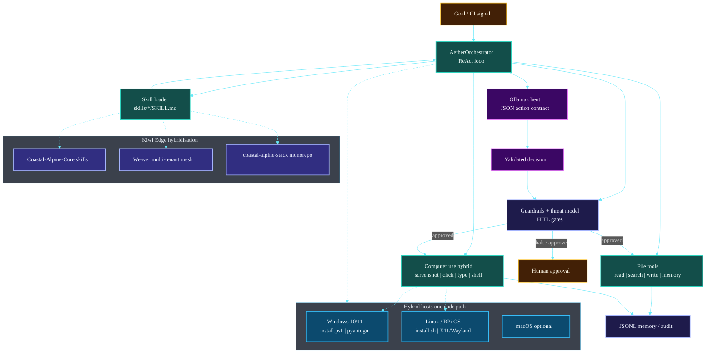

# Aether

[](./COMPLIANCE.md)
[](./COMPLIANCE.md)
[](./COMPLIANCE.md)
[](./COMPLIANCE.md)
[](./COMPLIANCE.md)
[](./COMPLIANCE_REGIONS.md)
[](./COMPLIANCE_REGIONS.md)
[](./SECURITY.md)
[](./COMPLIANCE.md)


<!-- BEGIN CAT_CONGRUENCE_SNIPPET -->
## Coastal Alpine Tech portfolio

[](https://github.com/fivepanelhat/fivepanelhat)
[](https://github.com/fivepanelhat/fivepanelhat)
[](./.github/agent-fleet/AGENTS.md)
[](https://github.com/fivepanelhat/fivepanelhat)

**Part of the [Kiwi Edge AI Stack](https://github.com/fivepanelhat/fivepanelhat)** | Founder OS: [NZ-Start-Up](https://github.com/fivepanelhat/NZ-Start-Up) | Agent policy: [`.github/agent-fleet/`](./.github/agent-fleet/)

> Sovereign hybrid edge AI for NZ farms and founders - local-first + multi-model, Te Mana Raraunga aligned - collaborating with Venture Taranaki, startups.com investors and Kotahitanga Investment Fund (HITL + cultural advisory for formal approaches).

**See [AI Infrastructure Leadership](https://github.com/fivepanelhat/fivepanelhat/blob/main/AI_INFRASTRUCTURE_LEADERSHIP.md) for our positioning as New Zealand's leader in sovereign edge AI Infrastructure.**

**Agents inform, draft, prepare, monitor, and remind. Humans advise, sign, file, send, and pay.** 
Anti-hallucination policy: [`.github/agent-fleet/anti-hallucination.md`](./.github/agent-fleet/anti-hallucination.md) | Congruence: [`CAT_CONGRUENCE.md`](./CAT_CONGRUENCE.md)
<!-- END CAT_CONGRUENCE_SNIPPET -->

<!-- BEGIN PRIVACY_SECURITY_GOVERNANCE -->
## Privacy / Security / Governance

Coastal Alpine Tech products treat operational and personal data as **taonga**. Defaults favour **local-first** operation, **purpose-limited** collection, and **Human-in-the-Loop** for high-stakes actions.

### Hard commitments

| Commitment | Statement |
| :--- | :--- |
| **No data sales** | **We do not sell personal information or customer operational data to third parties** for advertising, brokerage, or unrelated commercial exploitation. |
| **NZ Privacy Act 2020** | Collection, use, storage, and disclosure of personal information is designed to operate in accordance with the **Privacy Act 2020** information privacy principles (including IPP awareness and IPP 3A indirect-collection notification where applicable). |
| **Te Mana Raraunga** | Where Māori data or community data interests arise, systems are designed to operate **in accordance with Te Mana Raraunga** principles (including Rangatiratanga, Whakapapa, Whanaungatanga, Kotahitanga, Manaakitanga, Kaitiakitanga) as a sovereignty and stewardship lens — not as a marketing slogan. |
| **NZ AI safety** | AI features follow a **NZ AI safety-aligned** posture: Algorithm Charter spirit (fairness, transparency, human oversight where relevant), digital.govt.nz / responsible AI guidance awareness, no silent model training on private journals without consent, and HITL for high-stakes outcomes. |
| **Security** | No silent exfiltration; owner-controlled credentials; least privilege; SecOps / dependency hygiene on the fleet cadence. |
| **Governance** | Agents **inform, draft, prepare**; humans **advise, sign, file, send, and pay**. |

| Pillar | Commitment |
| :--- | :--- |
| **Privacy** | Local-first / offline-capable where practical; Privacy Act 2020; Te Mana Raraunga spirit; third-party AI only when **opt-in and labelled** |
| **Security** | No silent exfil of tenant or personal data; owner-controlled keys |
| **Governance** | HITL for high-stakes; Te Mana Raraunga spirit; multi-region compliance maps in [`COMPLIANCE_REGIONS.md`](./COMPLIANCE_REGIONS.md) |

**Agents inform, draft, prepare, monitor, and remind. Humans advise, sign, file, send, and pay.**

Fleet policy: [fivepanelhat / Kiwi Edge AI Stack](https://github.com/fivepanelhat/fivepanelhat) · [`COMPLIANCE.md`](./COMPLIANCE.md) · [`COMPLIANCE_REGIONS.md`](./COMPLIANCE_REGIONS.md) · [`SECURITY.md`](./SECURITY.md)
<!-- END PRIVACY_SECURITY_GOVERNANCE -->


<!-- BEGIN PROBLEMS_SOLUTIONS_ECONOMY -->
## Problems we are solving

**Aether** is the sovereign agentic companion (including computer-use paths) with hard HITL ceilings for NZ builders.

1. **Unconstrained agent hype** - "Autonomous employees" create legal, tax, and cultural risk in NZ.
2. **Tool sprawl** - Founders and engineers need one companion that can draft and operate tools under policy.
3. **Offshore default** - Agentic stacks often assume US cloud identity and data paths.
4. **Weak explainability** - Operators need skill routing and human gates, not black-box actuation.

## Solution we have built

| Built capability | What it does |
| :--- | :--- |
| **Agent orchestrator** | ReAct-style loop + skill routing |
| **Computer-use path** | Desktop operation where explicitly enabled |
| **Skill packs** | Super Grok governance skills (`aether-core`, CAT standards, skills CI) + NZ Start-Up fleet under `skills/nz-startup/` |
| **Licence** | Proprietary (Coastal Alpine Tech) - internal companion across CAT products |

Skills guide: [`docs/SKILLS.md`](./docs/SKILLS.md)

Policy slogan: **Agents inform, draft, prepare, monitor, and remind. Humans advise, sign, file, send, and pay.**

### Local (Taranaki) and national (Aotearoa) economic benefits

| Lever | Benefit |
| :--- | :--- |
| **Regional R&D HQ** | Product design and IP stay in New Plymouth / Taranaki - not only Auckland/offshore SaaS |
| **Primary-sector productivity** | On-farm and rural tools aim to cut waste, protect consents, and support export competitiveness |
| **Skilled employment pathways** | Edge install, field support, agritech ops, software, compliance, and cultural advisory roles as pilots scale |
| **Data sovereignty** | Te Mana Raraunga-aligned local custody keeps high-value operational data onshore |
| **HITL jobs quality** | Agents **inform / draft / prepare / monitor / remind**; humans **advise / sign / file / send / pay** - augment people, do not fake full autonomy |

**Stage honesty (pre-seed):** Impact today is founder R&D, near-term contractors, and EDA/partner leverage. Permanent multi-region payroll follows paid pilots and revenue - we do not invent headcount claims.
<!-- END PROBLEMS_SOLUTIONS_ECONOMY -->

[-8B2F45.svg)](./LICENSE)
[](https://www.python.org)
[](./CHANGELOG.md)

[](https://github.com/fivepanelhat/Aether)
[](https://github.com/fivepanelhat/Aether)
[](https://github.com/fivepanelhat/Aether)
[](https://github.com/fivepanelhat/Aether)

[](https://anthropic.com)
[](https://gemini.google.com)
[](https://openai.com)
[](https://x.ai)

[](https://github.com/fivepanelhat/Aether)
[](./docs/GETTING_STARTED.md)
[](./docs/ARCHITECTURE.md)

[](https://github.com/fivepanelhat/Aether/actions/workflows/ci.yml)
[](https://github.com/fivepanelhat/Aether/security/dependabot)


**Sovereign Agentic Development System**

Aether is a culturally grounded, extensible agentic development orchestrator. It helps you plan, debug, scaffold, and execute development work using tools and reusable skills while keeping you in control through strong human oversight.

**Coastal Alpine Tech Limited** pre-seed startup, New Plymouth, Taranaki, Aotearoa New Zealand.
**Canonical edge target:** Raspberry Pi 5 **(16GB)** with **Hailo-10H NPU** (40 TOPS). Local LLM via Ollama (`qwen2.5-coder` / Gemma 4 class models).

## Architecture Overview

> **Diagrams:** Architecture images and Mermaid maps describe the **target product architecture** for this pre-seed stack. They are engineering design maps not claims of large-scale commercial fleet deployment.

Aether is the **sovereign agentic development orchestrator** for the stack: ReAct loop over local tools and markdown skills, with HITL gates and optional Ollama (`qwen2.5-coder` / Gemma-class models) on developer or edge hardware.


### System map



 | Layer | Components | Role |
 | :--- | :--- | :--- |
 | **Loop** | ReAct + tools + computer use | One action per step (files *or* desktop) |
 | **Skills** | Markdown packs + Kiwi Edge skills | Domain procedures + stack architecture |
 | **Safety** | Guardrails + skill HITL | Writes / desktop actuation gated by default |
 | **LLM** | Ollama local (text + vision) | Offline-capable on Windows, Linux, RPi |
 | **Hosts** | `install.ps1` | `install.sh` | Same package; dual-platform installers |
 | **Hybrid stack** | Core | Weaver | coastal-alpine-stack | Companion for sovereign edge development |

*Full detail: [docs/ARCHITECTURE.md](./docs/ARCHITECTURE.md) | [docs/GETTING_STARTED.md](./docs/GETTING_STARTED.md)*

## Quick Start

### One-line install (recommended)

<details open>
<summary><strong> Linux / macOS</strong></summary>

```bash
curl -fsSL https://raw.githubusercontent.com/fivepanelhat/Aether/main/install.sh | bash
aether doctor
```

</details>

<details>
<summary><strong> Windows (PowerShell)</strong></summary>

```powershell
irm https://raw.githubusercontent.com/fivepanelhat/Aether/main/install.ps1 | iex
aether doctor
```

> **Note:** If script execution is blocked: `Set-ExecutionPolicy -Scope CurrentUser RemoteSigned`

</details>

### From a clone

<details open>
<summary><strong> Linux / macOS</strong></summary>

```bash
git clone https://github.com/fivepanelhat/Aether.git
cd Aether
python3 -m venv .venv && source .venv/bin/activate
pip install -e ".[computer]" # or: pip install -e . for CLI only
aether init
aether --help
aether skills
aether run "Audit the API routes for security issues"
```

</details>

<details>
<summary><strong> Windows (PowerShell)</strong></summary>

```powershell
git clone https://github.com/fivepanelhat/Aether.git
cd Aether
python -m venv .venv
.\.venv\Scripts\Activate.ps1
pip install -e ".[computer]" # or: pip install -e . for CLI only
aether init
aether --help
aether skills
aether run "Audit the API routes for security issues"
```

</details>

**Prerequisites (both platforms):** Python 3.10+, Git, [Ollama](https://ollama.com) for local models. On Linux desktop control also needs a display server (X11/Wayland) and often `python3-tk` / `scrot` depending on distro.

- **[Getting Started Guide](docs/GETTING_STARTED.md)**: A complete guide on how to use Aether's ReAct loop and tools.
- **[CLI Reference](docs/CLI_REFERENCE.md)**: A detailed reference of all available CLI commands.

### `aether remediate`

Trigger the error remediation workflow on a specific error or CI failure.

```bash
aether remediate "CI failed on main branch with test error in user.test.ts"
```

## Computer Use Edge AI that operates your desktop

Aether now hybridises **sovereign edge AI** with **computer use**: a local
(Ollama) vision model looks at screenshots and drives the real mouse, keyboard,
and shell to accomplish goals entirely on-device. No screenshots or keystrokes
leave the machine. Works on **Windows and Linux** (and macOS) from one code path.

### Download & install (terminal, cross-platform)

**Linux / macOS**

```bash
curl -fsSL https://raw.githubusercontent.com/fivepanelhat/Aether/main/install.sh | bash
```

**Windows (PowerShell)**

```powershell
irm https://raw.githubusercontent.com/fivepanelhat/Aether/main/install.ps1 | iex
aether doctor
```

Or from a clone, install the desktop extras alongside the base package:

```bash
pip install -e ".[computer]" # adds pyautogui + Pillow
aether doctor # verify Ollama + display + backend
```

The installers create an isolated virtualenv, expose the `aether` command on your
PATH, install the bundled skills, and check for the local [Ollama](https://ollama.com)
runtime. Pull a vision model once:

```bash
ollama pull qwen2.5-vl:7b # vision model for the agentic loop
ollama pull qwen2.5-coder:7b # text model for `aether run`
```

### Agentic desktop control

```bash
# Vision loop: Aether observes the screen and acts to reach the goal.
aether computer run "Open the calculator and compute 12 * 9"
aether computer run "Rename the selected file to report_final.txt" --max-steps 15

# Authorize actuation without per-step prompts (batch / trusted contexts):
aether computer run "Tidy my downloads folder" --auto-approve

# Rehearse without touching the mouse/keyboard:
aether computer run "..." --dry-run
```

By default every actuating step (click, type, key, scroll, shell) pauses for
**human approval** on a TTY, routed through the same guardrails/HITL layer that
gates Aether's file writes. `screenshot` and `screen_info` are read-only and
never gated.

Environment switches: `AETHER_COMPUTER_DRY_RUN=1` rehearses without actuating;
the vision model/host are overridable with `--model` / `--base-url`.

## Skills

Skills are markdown packs under `skills/*/SKILL.md`, auto-loaded at runtime. Full catalogue: **[docs/SKILLS_CATALOG.md](./docs/SKILLS_CATALOG.md)**.

```bash
python -m aether.cli skills
# or, after install:
aether skills
```

### Architecture & sovereignty (Kiwi Edge companion)

 | Skill | Role |
 | ----- | ---- |
 | **`kiwi-edge-architecture`** | System map: field -> MQTT -> Core -> Weaver -> portals -> Ollama/Hailo on **RPi 5 16GB + Hailo-10H** |
 | **`security-notifications-triage`** | Dependabot / GHSA / CodeQL / audit response (HITL for high-impact) |
 | **`te-mana-raraunga-sovereignty`** | **Te Mana Raraunga 2018** data-sovereignty constraints |

### Error remediation

 | Skill | Role |
 | ----- | ---- |
 | **`error-remediation-orchestrator`** | Analyze failures and propose/apply fixes (HITL) |
 | **`git-workflow`** | Branch, commit, push, PR (HITL) |
 | **`ci-failure-parser`** | Structure CI / Actions logs |
 | **`notification-responder`** | Status updates and approval requests |

Trigger manually or via GitHub webhook remediation:

```bash
aether run "Apply kiwi-edge-architecture and Te Mana Raraunga checks to this Core PR"
aether remediate "CI failed on main with test error in user.test.ts"
```

> **Note**: Git operations, code writes, and high-impact security changes require human approval by default.

## Required Setup for Advanced Features

Some features (especially error remediation and git operations) require additional configuration:

### GitHub Integration (Recommended)

To use the `git-workflow` skill effectively, you should have:
- A GitHub Personal Access Token (classic) with the following scopes:
 - `repo` (Full control of private repositories)
 - `workflow` (Update GitHub Action workflows)

**How to create a token:**
1. Go to GitHub -> Settings -> Developer settings -> Personal access tokens -> Tokens (classic)
2. Generate new token
3. Select the scopes listed above
4. Store the token securely (e.g. in a `.env` file or password manager)

> **Note**: Aether currently expects you to handle git authentication via your local environment (SSH keys or credential manager). Token support can be added later.

### GitHub Webhook Integration (CI Failure Auto-Trigger)

Aether can start investigation when your CI fails. **Default is propose-only** (read tools + plan; high-risk writes halt for HITL). Opt in to unattended writes with `AETHER_WEBHOOK_AUTO_REMEDIATE=1`.

1. **Start the webhook server**
 ```bash
 python run_webhook.py
 # or
 aether webhook
 # or on a custom port
 aether webhook --host 0.0.0.0 --port 9000
 ```

2. **Set your webhook secret** (required verification fails closed without it)
 ```bash
 export GITHUB_WEBHOOK_SECRET=your-secure-secret
 # Optional local-dev only bypass (never in production):
 # export AETHER_WEBHOOK_INSECURE=1
 # Optional: authorize high-risk tool actions from webhooks (default off):
 # export AETHER_WEBHOOK_AUTO_REMEDIATE=1
 ```

1. **Expose the server** using [ngrok](https://ngrok.com) or deploy to a server
 ```bash
 ngrok http 8000
 ```

4. **Register the webhook in GitHub**
 - Go to your repo -> Settings -> Webhooks -> Add webhook
 - Payload URL: `https://your-url/webhook/github`
 - Content type: `application/json`
 - Secret: your `GITHUB_WEBHOOK_SECRET` value
 - Events: Select **Workflow runs** and **Check runs**

### Webhook Retry Behavior

When a CI failure is received, Aether will attempt to trigger remediation up to **4 times** using exponential backoff (2s -> 4s -> 8s -> 16s).

If all retry attempts fail, the error is logged but no further automatic action is taken. You can still trigger remediation manually:

```bash
aether run "Investigate CI failure in <repo> on branch <branch>"
```

Retry parameters are configurable via environment variables:

 | Variable | Default | Description |
 | ------------------------ | --------- | ---------------------------------- |
 | `WEBHOOK_MAX_RETRIES` | `4` | Maximum number of retry attempts |
 | `WEBHOOK_MIN_WAIT` | `2` | Minimum wait between retries (s) |
 | `WEBHOOK_MAX_WAIT` | `30` | Maximum wait between retries (s) |

### Future Integrations

- Email parsing (for inbox-based remediation)
- Slack / Discord notifications
- GitHub App (for deeper integration without PAT)

## Project Structure

```text
Aether/
|-- aether/
| |-- webhooks/ # GitHub webhook handler (FastAPI)
| |-- tools/ # Core tools (file_writer, codebase_search, etc.)
| -- orchestrator.py # ReAct loop + skill routing
|-- skills/ # Reusable skills (add your own here)
|-- docs/ # Documentation
|-- examples/ # Usage examples
|-- run_webhook.py # Start the webhook server
|-- pyproject.toml # Packaging configuration
-- README.md
```

## Known Limitations

- Builder capabilities are still early (only the Project Scaffolder exists so far).
- Auto-remediation requires human approval at multiple steps for safety.
- Some advanced features (full auto-remediation, email triggers, etc.) are still in development.

We are actively working on improving generative (builder) capabilities.

## License

Proprietary — © 2026 Coastal Alpine Tech Limited. All rights reserved.
No open-source grant is implied by access to this repository; use is governed
solely by [LICENSE](LICENSE).

---

**Built with focus on data sovereignty and edge intelligence.**
**Coastal Alpine Tech Limited New Plymouth, Taranaki, New Zealand.**
