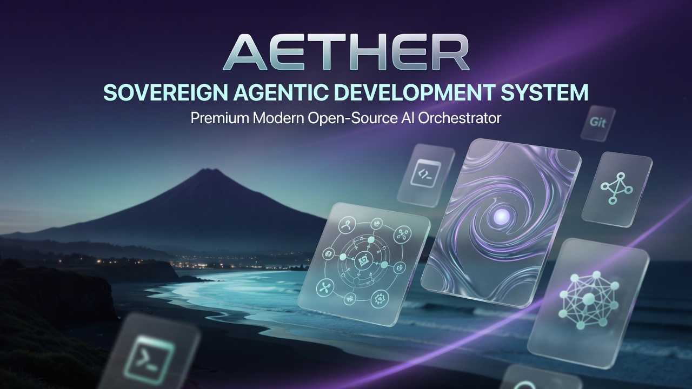
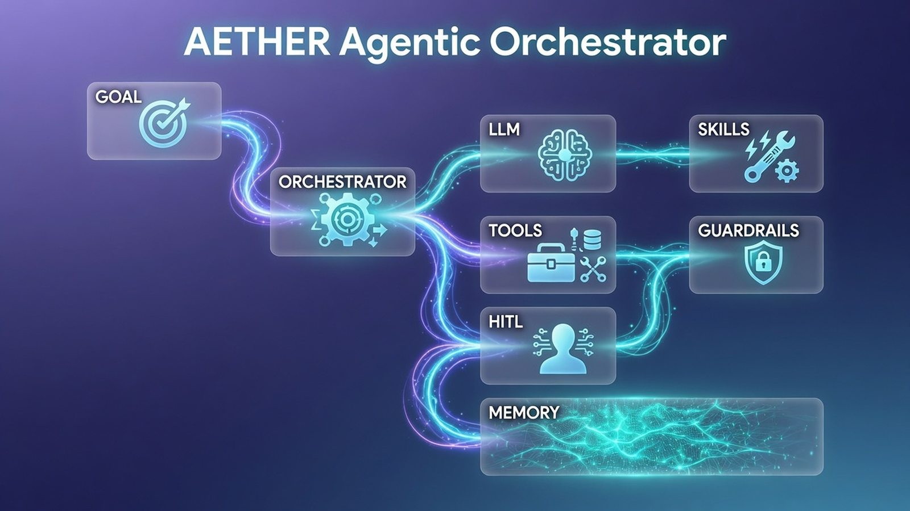
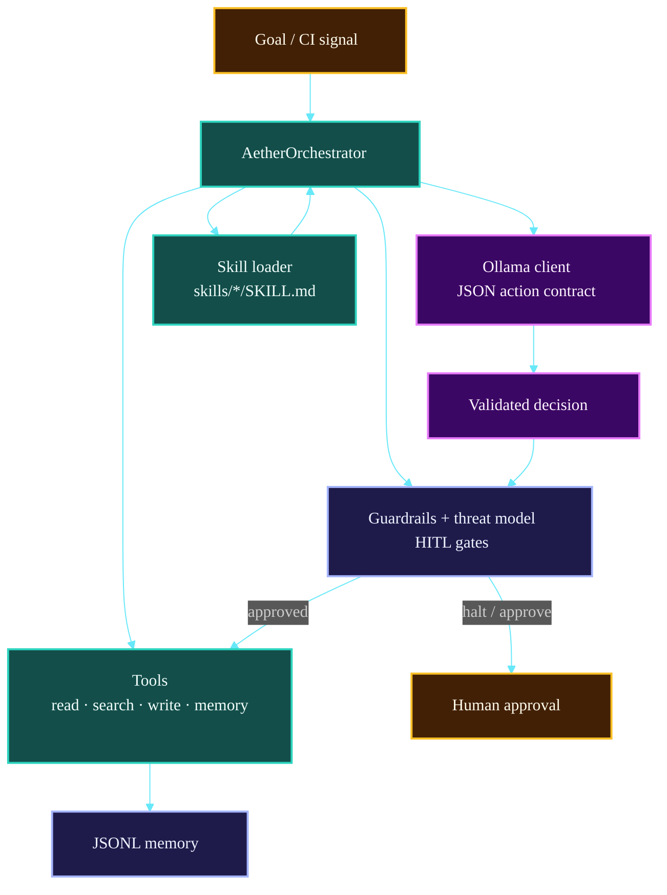

# Aether




**Sovereign Agentic Development System**

Aether is a culturally grounded, extensible agentic development orchestrator. It helps you plan, debug, scaffold, and execute development work using tools and reusable skills — while keeping you in control through strong human oversight.

**Coastal Alpine Tech Limited** - Companion orchestrator for the Kiwi Edge AI Stack.  
**Canonical edge target:** Raspberry Pi 5 **(16GB)** with **Hailo-10H NPU** (40 TOPS). Local LLM via Ollama (`qwen2.5-coder` / Gemma 4 class models).

## Architecture Overview

Aether is the **sovereign agentic development orchestrator** for the stack: ReAct loop over local tools and markdown skills, with HITL gates and optional Ollama (`qwen2.5-coder` / Gemma-class models) on developer or edge hardware.



### System map



| Layer | Components | Role |
| :--- | :--- | :--- |
| **Loop** | ReAct + tools | One action per step |
| **Skills** | Markdown packs | Domain procedures |
| **Safety** | Guardrails + skill HITL | Writes + `requires_hitl` / high-cultural skills gated by default |
| **LLM** | Ollama local | Offline-capable |

*Full detail: [docs/ARCHITECTURE.md](./docs/ARCHITECTURE.md) · [docs/GETTING_STARTED.md](./docs/GETTING_STARTED.md)*

## Quick Start

```bash
git clone https://github.com/fivepanelhat/Aether.git
cd Aether
pip install -e .

aether --help
aether skills
aether run "Audit the API routes for security issues"
```

- **[Getting Started Guide](docs/GETTING_STARTED.md)**: A complete guide on how to use Aether's ReAct loop and tools.
- **[CLI Reference](docs/CLI_REFERENCE.md)**: A detailed reference of all available CLI commands.

### `aether remediate`

Trigger the error remediation workflow on a specific error or CI failure.

```bash
aether remediate "CI failed on main branch with test error in user.test.ts"
```

## Skills

Skills are markdown packs under `skills/*/SKILL.md`, auto-loaded at runtime. Full catalogue: **[docs/SKILLS_CATALOG.md](./docs/SKILLS_CATALOG.md)**.

```bash
python -m aether.cli skills
# or, after install:
aether skills
```

### Architecture & sovereignty (Kiwi Edge companion)

| Skill | Role |
| ----- | ---- |
| **`kiwi-edge-architecture`** | System map: field → MQTT → Core → Weaver → portals → Ollama/Hailo on **RPi 5 16GB + Hailo-10H** |
| **`security-notifications-triage`** | Dependabot / GHSA / CodeQL / audit response (HITL for high-impact) |
| **`te-mana-raraunga-sovereignty`** | **Te Mana Raraunga 2018** data-sovereignty constraints |

### Error remediation

| Skill | Role |
| ----- | ---- |
| **`error-remediation-orchestrator`** | Analyze failures and propose/apply fixes (HITL) |
| **`git-workflow`** | Branch, commit, push, PR (HITL) |
| **`ci-failure-parser`** | Structure CI / Actions logs |
| **`notification-responder`** | Status updates and approval requests |

### Security auditors

`security-route-audit`, `security-auth-guard`, `error-message-sanitization`, `service-role-key-protection`, `strict-zod-schema-enforcement`, `release-preflight`, plus CI hygiene skills.

Trigger manually or via GitHub webhook remediation:

```bash
aether run "Apply kiwi-edge-architecture and Te Mana Raraunga checks to this Core PR"
aether remediate "CI failed on main with test error in user.test.ts"
```

> **Note**: Git operations, code writes, and high-impact security changes require human approval by default.

## Required Setup for Advanced Features

Some features (especially error remediation and git operations) require additional configuration:

### GitHub Integration (Recommended)

To use the `git-workflow` skill effectively, you should have:

- A GitHub Personal Access Token (classic) with the following scopes:
  - `repo` (Full control of private repositories)
  - `workflow` (Update GitHub Action workflows)

**How to create a token:**
1. Go to GitHub → Settings → Developer settings → Personal access tokens → Tokens (classic)
2. Generate new token
3. Select the scopes listed above
4. Store the token securely (e.g. in a `.env` file or password manager)

> **Note**: Aether currently expects you to handle git authentication via your local environment (SSH keys or credential manager). Token support can be added later.

### GitHub Webhook Integration (CI Failure Auto-Trigger)

Aether can start investigation when your CI fails. **Default is propose-only** (read tools + plan; high-risk writes halt for HITL). Opt in to unattended writes with `AETHER_WEBHOOK_AUTO_REMEDIATE=1`.

1. **Start the webhook server**
   ```bash
   python run_webhook.py
   # or
   aether webhook
   # or on a custom port
   aether webhook --host 0.0.0.0 --port 9000
   ```

2. **Set your webhook secret** (required — verification fails closed without it)
   ```bash
   export GITHUB_WEBHOOK_SECRET=your-secure-secret
   # Optional local-dev only bypass (never in production):
   # export AETHER_WEBHOOK_INSECURE=1
   # Optional: authorize high-risk tool actions from webhooks (default off):
   # export AETHER_WEBHOOK_AUTO_REMEDIATE=1
   ```

   Install webhook dependencies if needed:
   ```bash
   pip install -e ".[webhook]"
   ```

3. **Expose the server** using [ngrok](https://ngrok.com) or deploy to a server
   ```bash
   ngrok http 8000
   ```

4. **Register the webhook in GitHub**
   - Go to your repo → Settings → Webhooks → Add webhook
   - Payload URL: `https://your-url/webhook/github`
   - Content type: `application/json`
   - Secret: your `GITHUB_WEBHOOK_SECRET` value
   - Events: Select **Workflow runs** and **Check runs**

### Webhook Retry Behavior

When a CI failure is received, Aether will attempt to trigger remediation up to **4 times** using exponential backoff (2s → 4s → 8s → 16s).

If all retry attempts fail, the error is logged but no further automatic action is taken. You can still trigger remediation manually:

```bash
aether run "Investigate CI failure in <repo> on branch <branch>"
```

Retry parameters are configurable via environment variables:

| Variable               | Default | Description                      |
|------------------------|---------|----------------------------------|
| `WEBHOOK_MAX_RETRIES`  | `4`     | Maximum number of retry attempts |
| `WEBHOOK_MIN_WAIT`     | `2`     | Minimum wait between retries (s) |
| `WEBHOOK_MAX_WAIT`     | `30`    | Maximum wait between retries (s) |

### Future Integrations

- Email parsing (for inbox-based remediation)
- Slack / Discord notifications
- GitHub App (for deeper integration without PAT)

## Project Structure

```text
Aether/
├── aether/
│   ├── webhooks/         # GitHub webhook handler (FastAPI)
│   ├── tools/            # Core tools (file_writer, codebase_search, etc.)
│   └── orchestrator.py   # ReAct loop + skill routing
├── skills/               # Reusable skills (add your own here)
├── docs/                 # Documentation
├── examples/             # Usage examples
├── run_webhook.py        # Start the webhook server
├── pyproject.toml        # Packaging configuration
└── README.md
```

## Known Limitations

- Builder capabilities are still early (only the Project Scaffolder exists so far).
- Auto-remediation requires human approval at multiple steps for safety.
- Some advanced features (full auto-remediation, email triggers, etc.) are still in development.

We are actively working on improving generative (builder) capabilities.

## License

This project is licensed under the **Apache License 2.0**.

See [LICENSE](LICENSE) and [NOTICE](NOTICE) for details.

If you use this software, please provide appropriate credit to the Aether Project.

---

## Project badges

Status badges for this repository (CI, security, license, and stack metadata):

[](LICENSE)  
[](https://www.python.org/)  
[](CHANGELOG.md)  
[]()  
[]()  
[]()  
[](https://github.com/fivepanelhat/Aether/actions/workflows/ci.yml)  
[]()  
[]()
