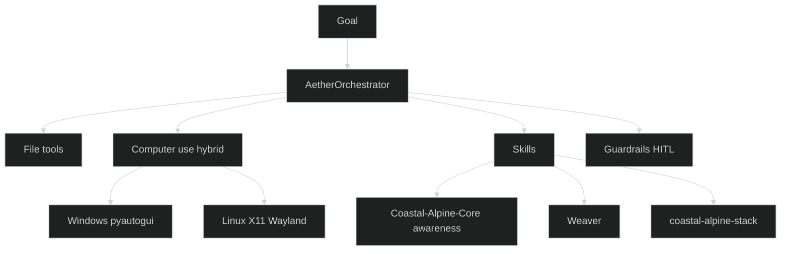

# Aether Architecture

This document describes the high-level architecture of Aether.

## Core Components

### Orchestrator
The central coordinator. It manages:
- Task state
- ReAct reasoning loop
- Tool and skill selection
- Execution flow
- Human-in-the-Loop gates

### Memory
Stores task history, decisions, and context across sessions. Supports persistence to disk.

### Guardrails
Enforces safety rules including:
- Human approval requirements for high-risk actions
- Cultural sensitivity checks
- Basic security constraints

### Tools
Modular capabilities the orchestrator can call, such as:
- Searching the codebase
- Reading files
- Querying memory
- Listing directories
- Writing files (with approval)

### Skills
Reusable, versioned units of knowledge and behavior. Skills can be:
- Suggested automatically based on the goal
- Loaded and executed during the ReAct loop
- Extended with custom execution logic

## Data Flow

1. User starts a task with a goal
2. Orchestrator suggests relevant skills
3. ReAct loop begins:
   - Reason about current state
   - Decide next action (tool or skill)
   - Execute action
   - Record result
4. Loop continues until task is complete or stopped
5. Final state and history are returned

## Design Principles

- **Sovereignty First**: Designed to run locally or in controlled environments.
- **Human-in-the-Loop**: High-impact actions require explicit approval.
- **Composability**: Skills and tools are modular and reusable.
- **Observability**: Actions, decisions, and results are logged and traceable.
- **Extensibility**: Easy to add new tools and skills over time.
- **Cross-platform**: One code path for **Windows and Linux** (and macOS).

## Hybridisation — Edge AI + Computer Use + Kiwi Stack

Aether hybridises three concerns:

1. **Sovereign edge AI** — local Ollama (text + vision), offline-capable
2. **Computer use** — screenshot / mouse / keyboard / shell via `aether computer` (Windows + Linux)
3. **Kiwi Edge companion** — skills for Core, Weaver, coastal-alpine-stack, Te Mana Raraunga

### Dual-platform install

| OS | Installer |
| :--- | :--- |
| Linux / macOS | `install.sh` — `curl -fsSL …/install.sh \| bash` |
| Windows | `install.ps1` — `irm …/install.ps1 \| iex` |

Extras: `pip install "aether[computer]"` for desktop control; `aether[webhook]` for CI remediation.

## Future Considerations

- Deeper multi-agent workflows with Weaver / LangGraph
- Richer computer-use planners for long desktop tasks
- Tighter Core SecurityGuard alignment on shared threat models
